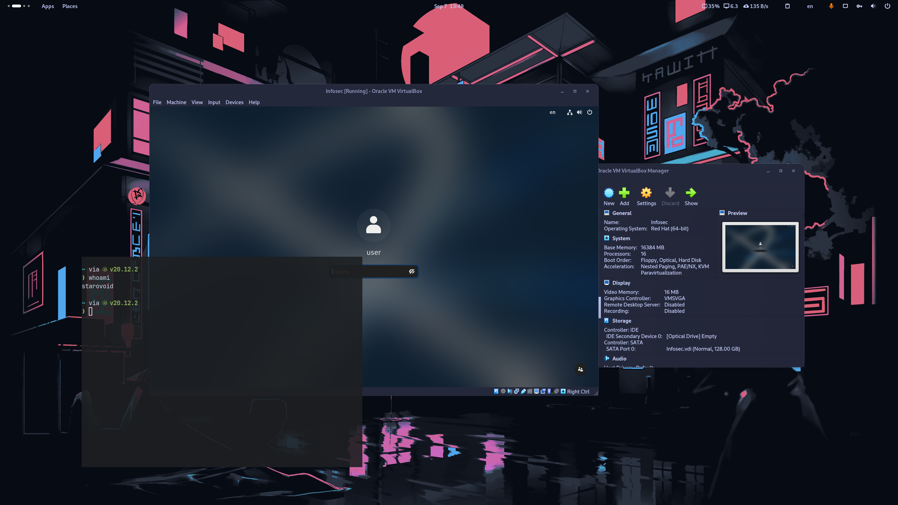

---
## Front matter
lang: ru-RU
title: Лабораторная работа №1
subtitle: Установка виртуальной машины
author:
  - Старовойтов Е. С.
institute:
  - Российский университет дружбы народов, Москва, Россия
date: 01 января 1970

## i18n babel
babel-lang: russian
babel-otherlangs: english

## Formatting pdf
toc: false
toc-title: Содержание
slide_level: 2
aspectratio: 169
section-titles: true
theme: metropolis
header-includes:
 - \metroset{progressbar=frametitle,sectionpage=progressbar,numbering=fraction}
---

# Информация
## Докладчик
Старовойтов Егор Сергеевич

# Цель работы
Целью данной работы является приобретение практических навыков
установки операционной системы на виртуальную машину, настройки минимально необходимых для дальнейшей работы сервисов.

# Задание
Целью данной работы является приобретение практических навыков
установки операционной системы на виртуальную машину, настройки минимально необходимых для дальнейшей работы сервисов.

# Выполнение лабораторной работы
Установил систему на виртуальную машину, выделив 16гб оперативной памяти, половину ядер CPU и 128гб на виртуальный жесткий диск.

{#fig:001 width=70%}

# Выводы
Установка ОС выполнена.

