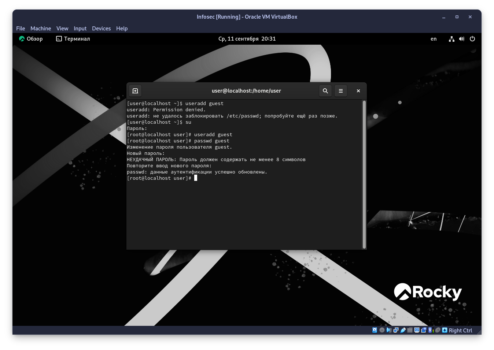
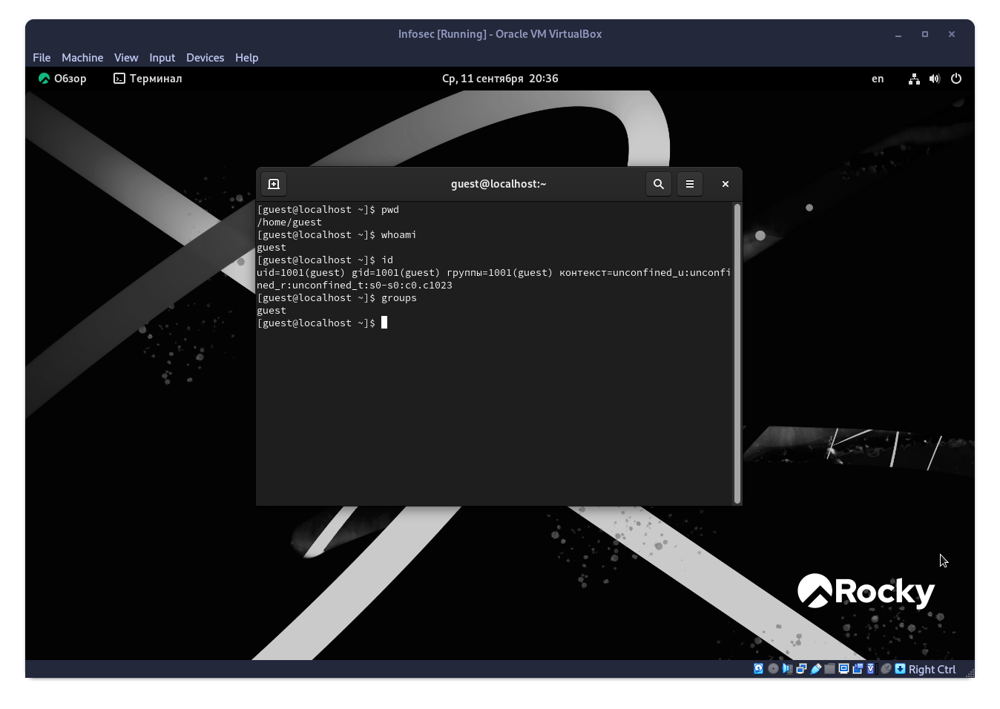
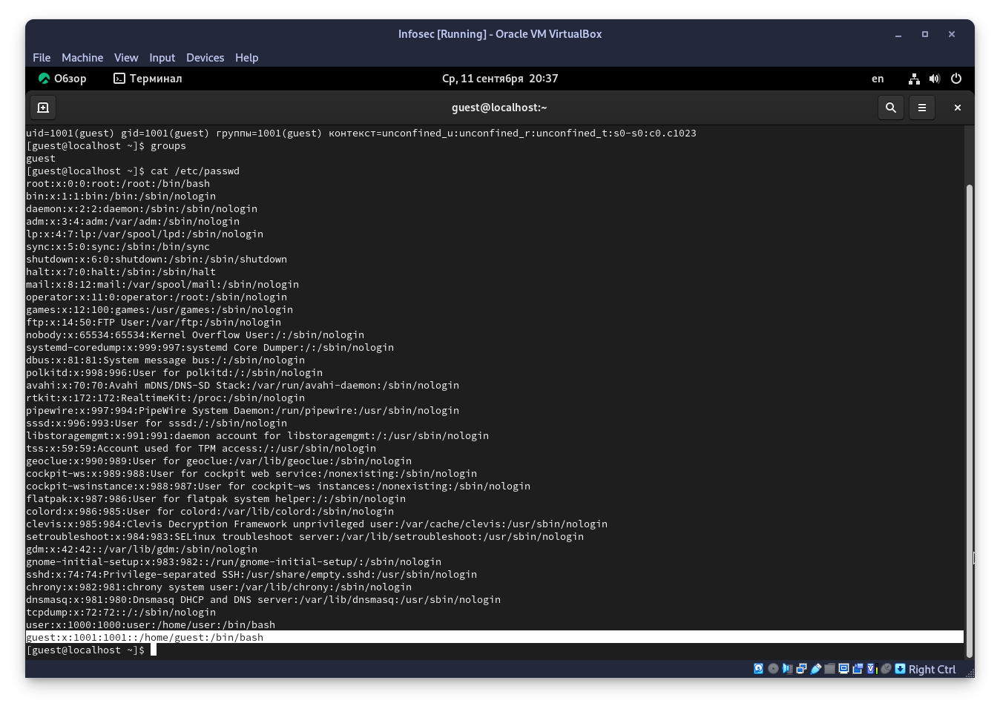
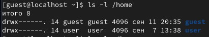
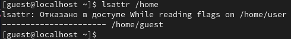
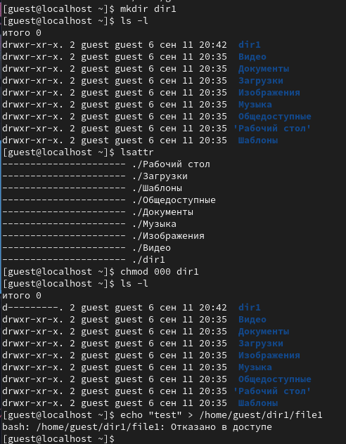

---
## Front matter
lang: ru-RU
title: Лабораторная работа №2
subtitle: Дискреционное разграничение прав в Linux. Основные атрибуты.
author:
  - Старовойтов Е. С.
institute:
  - Российский университет дружбы народов, Москва, Россия
date: 11 сентября 2024

## i18n babel
babel-lang: russian
babel-otherlangs: english

## Formatting pdf
toc: false
toc-title: Содержание
slide_level: 2
aspectratio: 169
section-titles: true
theme: metropolis
header-includes:
 - \metroset{progressbar=frametitle,sectionpage=progressbar,numbering=fraction}
---

# Цель работы
Получение практических навыков работы в консоли с атрибутами файлов, закрепление теоретических основ дискреционного разграничения доступа в современных системах с открытым кодом на базе ОС Linux.

# Задание
Получение практических навыков работы в консоли с атрибутами файлов, закрепление теоретических основ дискреционного разграничения доступа в современных системах с открытым кодом на базе ОС Linux.

# Выполнение лабораторной работы
## Шаги 1-2

## Шаги 3-7

## Шаг 8
Последняя строка файла. UID = 1001, GID = 1001

## Шаг 9

Как можно заметить по отображаемым правам, доступ к каталогам user и guest имеют только их владельцы, то есть сами пользователи.

## Шаг 10
Никаких дополнительных атрибутов, чужие атрибуты вообще нельзя посмотреть.

## Шаги 11-13

## Шаги 14-15
Для выполнения операций внутри dir1 нужно иметь права:
- w - для возможности создавать файлы и подкаталоги
- r - для возможности просмотреть содержимое с помощью ls и т.д.
- x для возможности перейти в каталог используя cd 

# Выводы
Я получил практические навыки по работе в консоли с атрибутами файлов, закрепил теоретические основы дискреционного разграничения доступа в современных системах с открытым кодом на базе ОС Linux.