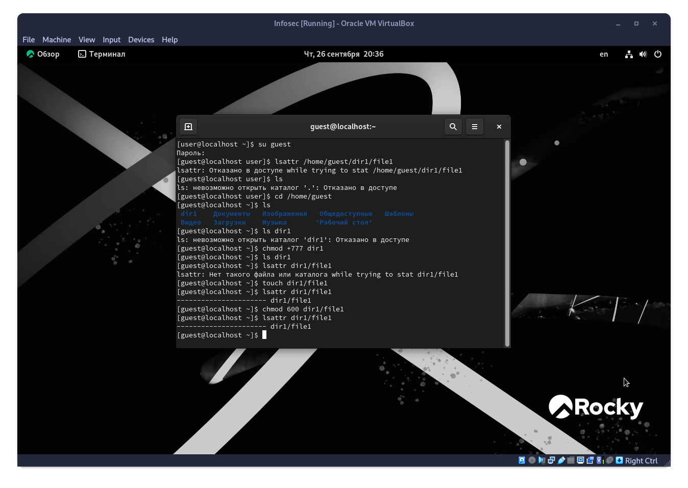
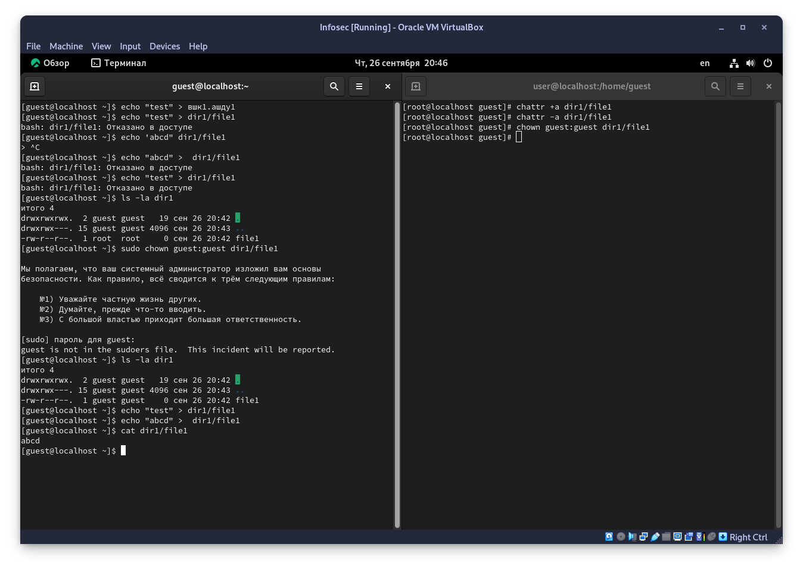
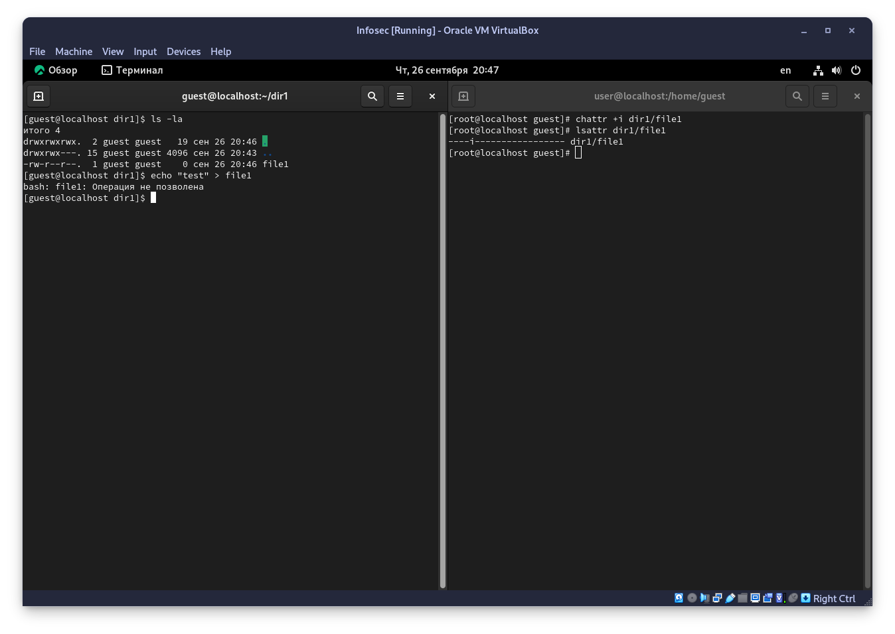

---
## Front matter
lang: ru-RU
title: Лабораторная работа №4
subtitle: Дискреционное разграничение прав в Linux. Расширенные атрибуты
author:
  - Старовойтов Е. С.
institute:
  - Российский университет дружбы народов, Москва, Россия
date: 26 сентября 2024

## i18n babel
babel-lang: russian
babel-otherlangs: english

## Formatting pdf
toc: false
toc-title: Содержание
slide_level: 2
aspectratio: 169
section-titles: true
theme: metropolis
header-includes:
 - \metroset{progressbar=frametitle,sectionpage=progressbar,numbering=fraction}
---

# Цель работы
Получение практических навыков работы в консоли с расширенными
атрибутами файлов.

# Задание
Получение практических навыков работы в консоли с атрибутами файлов, закрепление теоретических основ дискреционного разграничения доступа в современных системах с открытым кодом на базе ОС Linux.

# Выполнение лабораторной работы
## Шаги 1-2

## Шаги 3-9

## Шаг 10

# Выводы
Я получил практические навыки работы в консоли с расширенными
атрибутами файлов.