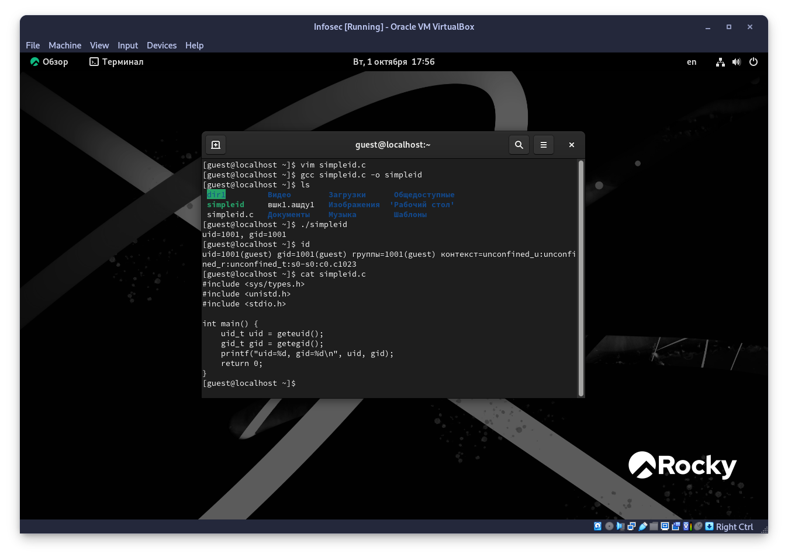
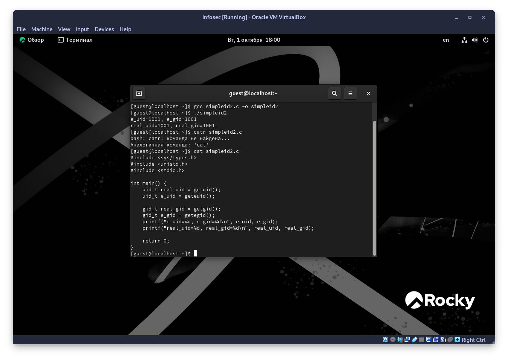
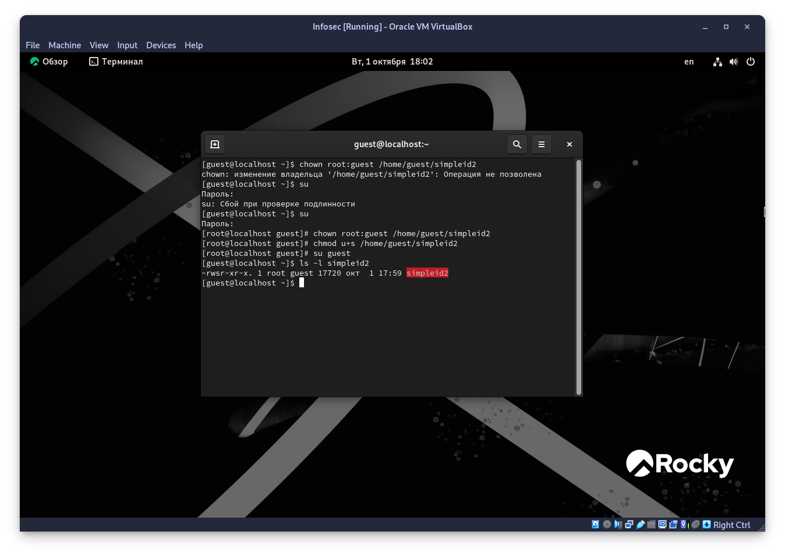
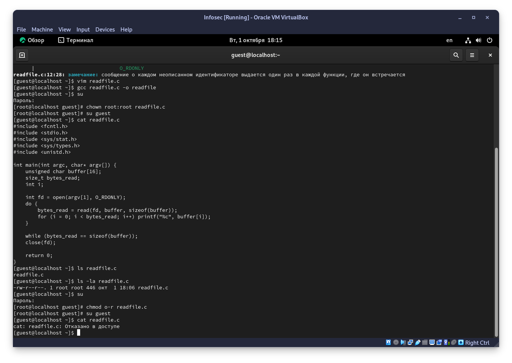
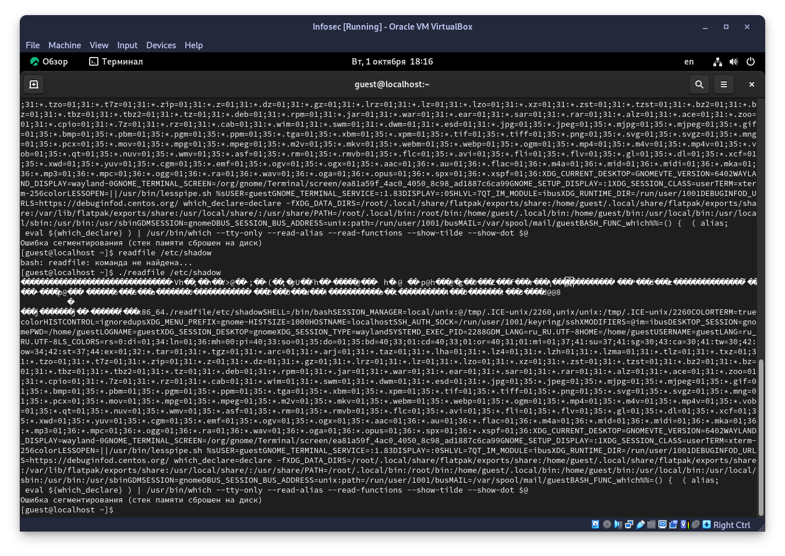
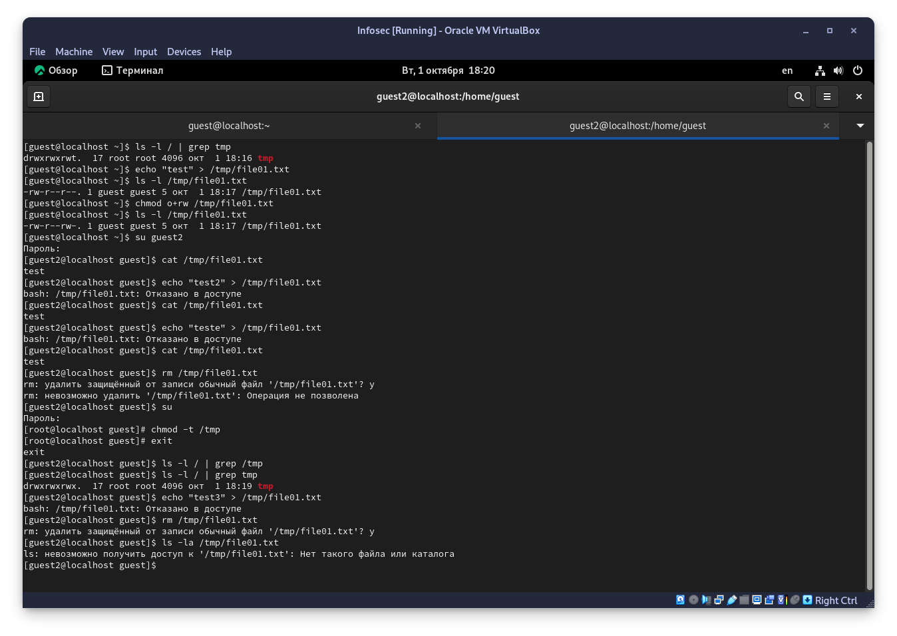

---
## Front matter
lang: ru-RU
title: Лабораторная работа №5
subtitle: Дискреционное разграничение прав в Linux. Исследование влияния дополнительных атрибутов
author:
  - Старовойтов Е. С.
institute:
  - Российский университет дружбы народов, Москва, Россия
date: 1 октября 2024

## i18n babel
babel-lang: russian
babel-otherlangs: english

## Formatting pdf
toc: false
toc-title: Содержание
slide_level: 2
aspectratio: 169
section-titles: true
theme: metropolis
header-includes:
 - \metroset{progressbar=frametitle,sectionpage=progressbar,numbering=fraction}
---

# Цель работы
Изучение механизмов изменения идентификаторов, применения
SetUID- и Sticky-битов. Получение практических навыков работы в консоли с дополнительными атрибутами. Рассмотрение работы механизма
смены идентификатора процессов пользователей, а также влияние бита
Sticky на запись и удаление файлов.

# Задание
Получение практических навыков работы в консоли с атрибутами файлов, закрепление теоретических основ дискреционного разграничения доступа в современных системах с открытым кодом на базе ОС Linux.

# Выполнение лабораторной работы
## Шаги 1-5

## Шаги 6-7

## Шаги 8-10

## Шаги 11-17

## Шага 18-19

## Исследование sticky-бита

# Выводы
Я получил практические навыки работы в консоли с расширенными
атрибутами файлов.