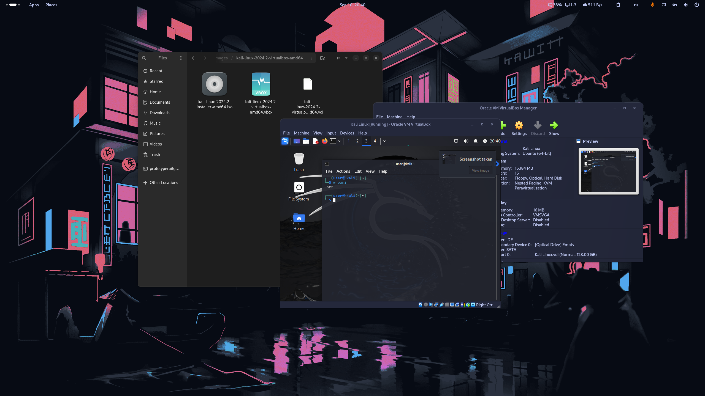

---
## Front matter
lang: ru-RU
title: Индивидуальный проект - этап 1
subtitle: Установка Kali Linux на виртуальную машину
author:
  - Старовойтов Е. С.
institute:
  - Российский университет дружбы народов, Москва, Россия
date: 10 сентября 2024

## i18n babel
babel-lang: russian
babel-otherlangs: english

## Formatting pdf
toc: false
toc-title: Содержание
slide_level: 2
aspectratio: 169
section-titles: true
theme: metropolis
header-includes:
 - \metroset{progressbar=frametitle,sectionpage=progressbar,numbering=fraction}
---

# Цель работы
Целью данной работы является установка Kali Linux на виртуальную машину.

# Задание
В качестве среды виртуализации  использовался VirtualBox.

# Выполнение лабораторной работы
1. Скачал образ операционной системы с официального сайта.
2. Установил систему на виртуальную машину, выделив 16гб оперативной памяти, половину ядер CPU и 128гб на виртуальный жесткий диск.

{#fig:001 width=70%}

# Выводы
Установка ОС выполнена.