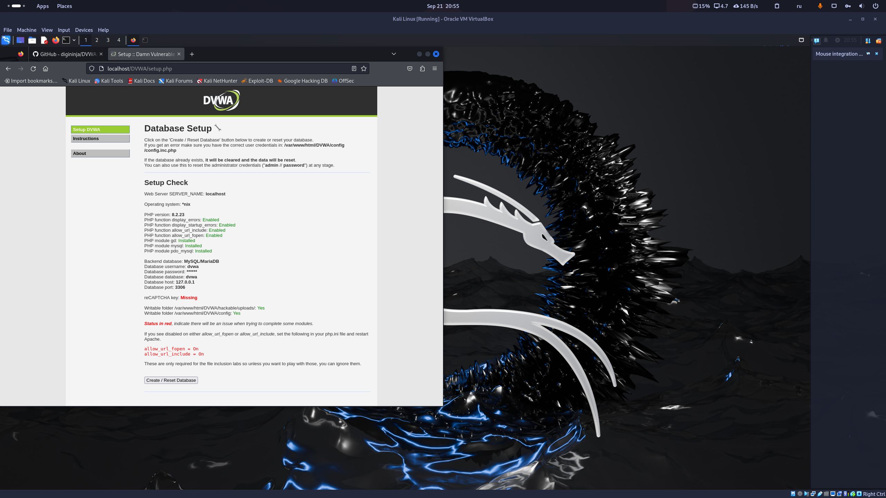

---
## Front matter
lang: ru-RU
title: Индивидуальный проект - этап 5
subtitle: Установка DVWA
author:
  - Старовойтов Е. С.
institute:
  - Российский университет дружбы народов, Москва, Россия
date: 5 октября 2024

## i18n babel
babel-lang: russian
babel-otherlangs: english

## Formatting pdf
toc: false
toc-title: Содержание
slide_level: 2
aspectratio: 169
section-titles: true
theme: metropolis
header-includes:
 - \metroset{progressbar=frametitle,sectionpage=progressbar,numbering=fraction}
---

# Цель работы
Целью данной работы является установка DVWA на виртуальную машину.

# Задание
Установка DVWA

# Выполнение лабораторной работы
1. Установил DVWA.

# Выводы
Установка DVWA выполнена.